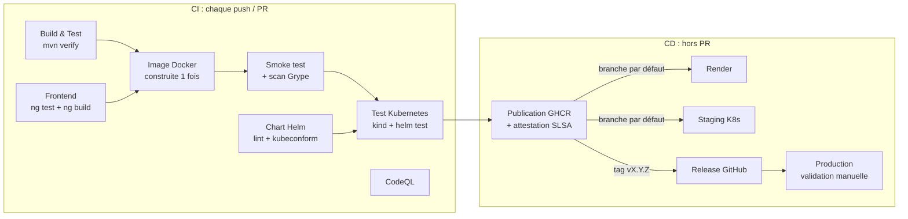

# first-app — Mes lectures

Carnet de lectures en ligne : on crée un compte, on se connecte, et on note les livres lus (note de 1 à 5 étoiles,
date de lecture, commentaire). Spring Boot 4 + Angular 22 + PostgreSQL 17, livré par une chaîne CI/CD complète :
tests, image Docker, analyse de sécurité, déploiement sur Render et Kubernetes via Helm.

## Architecture

```
navigateur ──► Spring Boot (un seul service, même origine : pas de CORS)
                 ├─ /            front-end Angular (fichiers statiques embarqués dans le JAR)
                 ├─ /api/auth/*  inscription, connexion, déconnexion, utilisateur courant
                 ├─ /api/books   livres de l'utilisateur connecté
                 └─ /health      sondes (liveness / readiness)
                        │
                        ▼
                   PostgreSQL  (schéma versionné par Flyway, sessions stockées en base)
```

| Couche | Choix |
|--------|-------|
| API | Spring Boot 4.1 (Spring MVC, threads virtuels), erreurs au format ProblemDetail (RFC 9457) |
| Données | PostgreSQL 17, Spring Data JPA / Hibernate 7, migrations Flyway (`src/main/resources/db/migration`) |
| Images | couvertures stockées dans PostgreSQL (table `book_cover`, séparée pour garder la liste rapide) |
| Sessions | Spring Session JDBC : les connexions survivent aux redémarrages et aux mises en veille |
| Front-end | Angular 22 : composants standalone, signals, routes chargées à la demande, tests Vitest |

### API

| Route | Rôle |
|-------|------|
| `POST /api/auth/register` | crée un compte (`email`, `password` ≥ 8 caractères, `displayName`) et connecte |
| `POST /api/auth/login` | connexion (`email`, `password`) |
| `POST /api/auth/logout` | déconnexion |
| `GET /api/auth/me` | utilisateur connecté (401 sinon) |
| `GET /api/books` | mes livres, lectures les plus récentes d'abord |
| `POST /api/books` | ajoute un livre (`title`, `author`, `readOn`, `rating` 1-5, `comment`) |
| `PUT /api/books/{id}` | modifie un livre |
| `DELETE /api/books/{id}` | supprime un livre |
| `PUT /api/books/{id}/cover` | envoie la couverture (`multipart/form-data`, champ `file`, JPEG ou PNG, 10 Mo max) |
| `GET /api/books/{id}/cover?v=…` | couverture (JPEG) ; l'URL change à chaque nouvelle image, d'où un cache d'un an |
| `DELETE /api/books/{id}/cover` | retire la couverture |
| `GET /health`, `/health/liveness`, `/health/readiness` | état de l'application (readiness inclut la base) |
| `GET /version`, `GET /hello?name=…` | version déployée, route de test (utilisées par la CI) |

### Sécurité

- **Session serveur** dans un cookie `HttpOnly`, `Secure`, `SameSite=Lax` : aucun jeton lisible par JavaScript.
- **CSRF** : cookie `XSRF-TOKEN` renvoyé par Angular dans l'en-tête `X-XSRF-TOKEN` (mode SPA de Spring Security).
- **Mots de passe** hachés (bcrypt) ; ≥ 8 caractères, sans règle de composition (recommandations NIST 800-63B).
- **À la connexion**, nouvel identifiant de session et nouveau jeton CSRF (fixation de session).
- **Force brute** : 5 échecs en 15 minutes bloquent le compte pour 15 minutes ; même message d'erreur que l'adresse
  existe ou non.
- **Isolation** : chaque requête est limitée aux livres de l'utilisateur ; ceux des autres répondent 404.
- **Couvertures** : le serveur décode le fichier sans se fier au type déclaré, refuse ce qui n'est pas un vrai JPEG
  ou PNG et les images démesurées, puis réencode en JPEG de 800 px au plus. Les métadonnées (EXIF, GPS) et tout
  contenu caché disparaissent. Le navigateur réduit l'image avant l'envoi (≈ 20 à 120 Ko par couverture).
- **En-têtes** : Content-Security-Policy stricte, `X-Frame-Options`, `X-Content-Type-Options`.

## Développement

Prérequis : Java 21 et Node.js 24 (≥ 24.15). **Ni Docker ni PostgreSQL à installer** : un vrai PostgreSQL est
téléchargé et lancé automatiquement (bibliothèque zonky embedded-postgres).

```bash
scripts/dev.sh          # API + base sur :8080, Angular sur http://localhost:4200 (rechargement à chaud)
```

Les données de développement sont conservées dans `.dev-db/` ; supprimez ce dossier pour repartir de zéro.
Pour lancer seulement l'API : `./mvnw spring-boot:test-run -Dspring-boot.run.main-class=com.example.app.DevApplication`.

```bash
./mvnw verify                  # build complet : tests unitaires + intégration (PostgreSQL embarqué), couverture…
./mvnw spotless:apply          # reformate le code Java
cd frontend && npx ng test     # tests Angular
```

Nouvelle évolution du schéma : ajouter un fichier `V3__description.sql` dans `db/migration` (ne jamais modifier une
migration déjà déployée).

Contrôles exécutés par `./mvnw verify`, en local comme en CI :

| Contrôle | Outil |
|----------|-------|
| Versions de Java/Maven et des plugins | maven-enforcer |
| Formatage du code et du `pom.xml` | Spotless (palantir-java-format) |
| Compilation sans aucun avertissement | `-Xlint:all -Werror` |
| Tests unitaires (`*Test.java`) | Surefire + JUnit 6 |
| Tests d'intégration (`*IT.java` : application complète, PostgreSQL réel, parcours navigateur) | Failsafe |
| Couverture de lignes ≥ 80 % | JaCoCo |

Le build est reproductible : deux builds du même commit produisent un JAR identique à l'octet près.

## Architecture de livraison



Principes appliqués :

- **Construire une fois, déployer partout** : l'image est construite une seule fois. Ce même binaire est testé, scanné, poussé sur GHCR puis déployé en staging et en production.
- **Tags immuables** : on déploie `sha-xxxxxxx` (staging) ou `X.Y.Z` (production), jamais `latest`.
- **Chaîne d'approvisionnement** : actions GitHub et images de base épinglées par empreinte (SHA / digest), mises à jour par Dependabot. Si le dépôt est public, l'image publiée porte une attestation de provenance (vérifiable avec `gh attestation verify oci://ghcr.io/thepja/first-app:X.Y.Z --owner thepja`).
- **Sécurité** : CodeQL sur le code (dépôt public uniquement, sinon GitHub Advanced Security requis), Grype sur l'image (échec si une vulnérabilité haute ou critique corrigeable est trouvée), conteneur non-root en lecture seule, permissions GitHub minimales par job.
- **Déploiements sûrs** : `helm upgrade --atomic` (rollback automatique si les pods ne démarrent pas), mise à jour progressive sans interruption, `helm test` après chaque déploiement, un seul déploiement à la fois par environnement.

### Workflows

Les étapes de la chaîne sont des **workflows réutilisables** du dépôt [thepja/template-ci-cd](https://github.com/thepja/template-ci-cd),
partagé entre mes projets et épinglé par SHA de commit. Ce dépôt ne contient aucun script de CI/CD : seulement l'assemblage des étapes et les descriptions propres à l'application (Dockerfile, chart Helm, `render.yaml`).

| Fichier | Rôle |
|---------|------|
| `.github/workflows/ci-cd.yml` | seul workflow du projet : assemble `java-maven-ci`, `node-ci`, `codeql`, `helm-lint`, `docker-build`, `k8s-test`, `docker-publish`, `deploy-helm`, `deploy-render` et `github-release` du template |
| `.github/dependabot.yml` | mises à jour hebdomadaires : Maven, npm (Angular), actions GitHub, images Docker |

### Versions

La version vient du tag git : `v1.2.3` donne un JAR `1.2.3` et une image `ghcr.io/thepja/first-app:1.2.3` (plus `1.2`).
Hors tag, la version est `0.0.0-<sha>`.

```bash
git tag v1.0.0 && git push origin v1.0.0     # release + déploiement production
```

## Kubernetes (Helm)

```
helm/first-app/
├── Chart.yaml
├── values.yaml              # valeurs par défaut
├── values.schema.json       # validation des valeurs (erreur explicite si une valeur est invalide)
├── values-staging.yaml      # 1 réplica
├── values-production.yaml   # autoscaling 3-10, PDB, NetworkPolicy, répartition sur les nœuds
└── templates/               # Deployment, Service, ServiceAccount, Ingress, HPA, PDB, NetworkPolicy, test
```

Ce que le chart met en place :

| Aspect | Mise en œuvre |
|--------|---------------|
| Sondes | `startupProbe`, `readinessProbe`, `livenessProbe` sur `/health` |
| Mise à jour | `RollingUpdate` avec `maxUnavailable: 0` |
| Arrêt | `preStop` de 5 s (le temps que le Service retire le pod), puis `SIGTERM` et arrêt propre de la JVM |
| Base de données | Secret `first-app-db` (clés `url`, `username`, `password`) à créer dans chaque namespace, hors du chart |
| Sécurité | non-root, système de fichiers en lecture seule, aucune capability, seccomp `RuntimeDefault`, pas de jeton d'API monté |
| Disponibilité (prod) | HPA, PodDisruptionBudget, `topologySpreadConstraints` |
| Réseau (prod) | NetworkPolicy : seul le port HTTP accepte du trafic entrant |
| Mémoire JVM | `-XX:MaxRAMPercentage=75` : le tas s'adapte à la limite du conteneur |

Déploiement manuel :

```bash
helm upgrade --install first-app helm/first-app -n first-app-staging --create-namespace \
  -f helm/first-app/values-staging.yaml \
  --set image.repository=ghcr.io/thepja/first-app --set-string image.tag=sha-abc1234 \
  --atomic --wait --timeout 5m
helm test first-app -n first-app-staging
helm history first-app -n first-app-staging
helm rollback first-app -n first-app-staging
```

Exposer l'application : activer l'ingress dans le fichier de valeurs de l'environnement.

```yaml
ingress:
  enabled: true
  className: nginx
  hosts:
    - host: first-app.mondomaine.fr
      paths: [{ path: /, pathType: Prefix }]
networkPolicy:
  from:
    - namespaceSelector:
        matchLabels: { kubernetes.io/metadata.name: ingress-nginx }
```

## Render

Le service Render (`render.yaml`) construit l'image à partir du `Dockerfile` de ce dépôt : type web, plan gratuit, région Oregon, sonde de santé sur `/health`.
Render fournit la variable `PORT`, que l'application lit.

Le déploiement automatique de Render est **désactivé** : c'est la CI qui déclenche le déploiement,
uniquement sur la branche par défaut, après le succès de tous les tests, et en désignant le commit exact qui a été validé.
Le job attend ensuite que `/version` renvoie la version de ce commit (`0.0.0-<sha>`), puis vérifie `/hello`.

Mise en place (une fois) :

1. **Donner à Render l'accès au dépôt** : *Render → New → Web Service → GitHub → Configure GitHub* (ou *github.com/settings/installations → Render → Configure*), autoriser le dépôt `thepja/first-app`.
2. **Réglages du service** (*Render → first-app → Settings*) : *Auto-Deploy* sur **Off** (la CI s'en charge) et *Health Check Path* sur `/health`.
3. **Relier la CI** : dans GitHub, créer l'environnement `render` avec :
   - le secret `RENDER_DEPLOY_HOOK_URL` : *Render → first-app → Settings → Deploy Hook* ;
   - la variable `RENDER_SERVICE_URL` : l'URL publique du service (ex. `https://first-app-xxxx.onrender.com`).

4. **Base de données** : base PostgreSQL 17 `first-app-db` (même région), reliée par les variables
   `SPRING_DATASOURCE_URL` (`jdbc:postgresql://<hôte interne>:5432/<base>`), `SPRING_DATASOURCE_USERNAME` et
   `SPRING_DATASOURCE_PASSWORD` du service.

Sur le plan gratuit, le service se met en veille après 15 minutes sans trafic ; la première requête suivante prend alors environ une minute.
La base gratuite est **supprimée par Render au bout de 30 jours** : passez-la sur un plan payant pour conserver les données.

## Configuration GitHub à faire une fois

1. **Environnements** (*Settings → Environments*) : créer `staging` et `production`.
   - Dans chacun, ajouter le secret `KUBE_CONFIG` : le kubeconfig encodé en base64 (`base64 -w0 kubeconfig`), idéalement celui d'un ServiceAccount limité au namespace `first-app-<env>`. Sans ce secret, le déploiement est ignoré avec un avertissement.
   - Sur `production` : activer *Required reviewers* (validation manuelle) et limiter les déploiements aux tags `v*`.
2. **Image GHCR** : la rendre publique (*Packages → first-app → Package settings*) ou créer un secret de pull dans chaque namespace et le référencer dans `imagePullSecrets`.
3. **Protection de branche** sur la branche par défaut : exiger une PR et le succès des checks *Build & Test / Maven*, *Frontend (Angular) / Node 24*, *Helm chart / Helm lint*, *Docker image / Build, smoke test et scan*, *Kubernetes (kind) / Déploiement kind* et *CodeQL / Analyse* (les workflows réutilisables préfixent le nom du job appelant).
