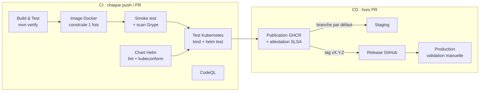

# first-app

Petite application Java 21 (serveur HTTP sans dépendance) livrée par une chaîne CI/CD complète :
tests, image Docker, analyse de sécurité, déploiement Kubernetes via Helm.

## Application

| Route | Réponse |
|-------|---------|
| `GET /health` | `OK` (sondes Kubernetes) |
| `GET /hello?name=Alice` | `Hello, Alice!` |
| autre méthode que `GET` | `405 Method Not Allowed` |

- Threads virtuels (Java 21) pour traiter les requêtes.
- Arrêt propre sur `SIGTERM` : les requêtes en cours se terminent avant l'arrêt.
- Port configurable par la variable d'environnement `PORT` (8080 par défaut).

## Développement

```bash
./mvnw verify                  # build complet avec toutes les vérifications (voir ci-dessous)
./mvnw spotless:apply          # reformate le code
java -jar target/first-app.jar

docker build -t first-app .
docker run -p 8080:8080 first-app
```

Contrôles exécutés par `./mvnw verify`, en local comme en CI :

| Contrôle | Outil |
|----------|-------|
| Versions de Java/Maven et des plugins | maven-enforcer |
| Formatage du code et du `pom.xml` | Spotless (palantir-java-format) |
| Compilation sans aucun avertissement | `-Xlint:all -Werror` |
| Tests unitaires (`*Test.java`) | Surefire + JUnit 5 |
| Tests d'intégration (`*IT.java`, serveur HTTP réel) | Failsafe |
| Couverture de lignes ≥ 80 % | JaCoCo |

Le build est reproductible : deux builds du même commit produisent un JAR identique à l'octet près.

## Architecture de livraison



Principes appliqués :

- **Construire une fois, déployer partout** : l'image est construite une seule fois. Ce même binaire est testé, scanné, poussé sur GHCR puis déployé en staging et en production.
- **Tags immuables** : on déploie `sha-xxxxxxx` (staging) ou `X.Y.Z` (production), jamais `latest`.
- **Chaîne d'approvisionnement** : actions GitHub et images de base épinglées par empreinte (SHA / digest), mises à jour par Dependabot. L'image publiée porte une attestation de provenance (vérifiable avec `gh attestation verify oci://ghcr.io/thepja/first-app:X.Y.Z --owner thepja`).
- **Sécurité** : CodeQL sur le code, Grype sur l'image (échec si une vulnérabilité haute ou critique corrigeable est trouvée), conteneur non-root en lecture seule, permissions GitHub minimales par job.
- **Déploiements sûrs** : `helm upgrade --atomic` (rollback automatique si les pods ne démarrent pas), mise à jour progressive sans interruption, `helm test` après chaque déploiement, un seul déploiement à la fois par environnement.

### Workflows

| Fichier | Rôle |
|---------|------|
| `.github/workflows/ci-cd.yml` | pipeline principal (schéma ci-dessus) |
| `.github/workflows/deploy.yml` | workflow réutilisable de déploiement Helm, appelé pour staging et production |
| `.github/workflows/codeql.yml` | analyse de sécurité du code (à chaque push/PR et chaque semaine) |
| `.github/dependabot.yml` | mises à jour hebdomadaires : Maven, actions GitHub, images Docker |

### Versions

La version vient du tag git : `v1.2.3` donne un JAR `1.2.3` et une image `ghcr.io/thepja/first-app:1.2.3` (plus `1.2`).
Hors tag, la version est `0.0.0-<sha>`.

```bash
git tag v1.0.0 && git push origin v1.0.0     # release + déploiement production
```

## Kubernetes (Helm)

```
helm/first-app/
├── Chart.yaml
├── values.yaml              # valeurs par défaut
├── values.schema.json       # validation des valeurs (erreur explicite si une valeur est invalide)
├── values-staging.yaml      # 1 réplica
├── values-production.yaml   # autoscaling 3-10, PDB, NetworkPolicy, répartition sur les nœuds
└── templates/               # Deployment, Service, ServiceAccount, Ingress, HPA, PDB, NetworkPolicy, test
```

Ce que le chart met en place :

| Aspect | Mise en œuvre |
|--------|---------------|
| Sondes | `startupProbe`, `readinessProbe`, `livenessProbe` sur `/health` |
| Mise à jour | `RollingUpdate` avec `maxUnavailable: 0` |
| Arrêt | `preStop` de 5 s (le temps que le Service retire le pod), puis `SIGTERM` et arrêt propre de la JVM |
| Sécurité | non-root, système de fichiers en lecture seule, aucune capability, seccomp `RuntimeDefault`, pas de jeton d'API monté |
| Disponibilité (prod) | HPA, PodDisruptionBudget, `topologySpreadConstraints` |
| Réseau (prod) | NetworkPolicy : seul le port HTTP accepte du trafic entrant |
| Mémoire JVM | `-XX:MaxRAMPercentage=75` : le tas s'adapte à la limite du conteneur |

Déploiement manuel :

```bash
scripts/helm-deploy.sh staging ghcr.io/thepja/first-app:sha-abc1234
helm test first-app -n first-app-staging
helm history first-app -n first-app-staging
helm rollback first-app -n first-app-staging
```

Exposer l'application : activer l'ingress dans le fichier de valeurs de l'environnement.

```yaml
ingress:
  enabled: true
  className: nginx
  hosts:
    - host: first-app.mondomaine.fr
      paths: [{ path: /, pathType: Prefix }]
networkPolicy:
  from:
    - namespaceSelector:
        matchLabels: { kubernetes.io/metadata.name: ingress-nginx }
```

## Configuration GitHub à faire une fois

1. **Environnements** (*Settings → Environments*) : créer `staging` et `production`.
   - Dans chacun, ajouter le secret `KUBE_CONFIG` : le kubeconfig encodé en base64 (`base64 -w0 kubeconfig`), idéalement celui d'un ServiceAccount limité au namespace `first-app-<env>`. Sans ce secret, le déploiement est ignoré avec un avertissement.
   - Sur `production` : activer *Required reviewers* (validation manuelle) et limiter les déploiements aux tags `v*`.
2. **Image GHCR** : la rendre publique (*Packages → first-app → Package settings*) ou créer un secret de pull dans chaque namespace et le référencer dans `imagePullSecrets`.
3. **Protection de branche** sur la branche par défaut : exiger une PR et le succès des jobs *Build & Test*, *Helm chart*, *Docker image*, *Kubernetes (kind)* et *CodeQL*.
